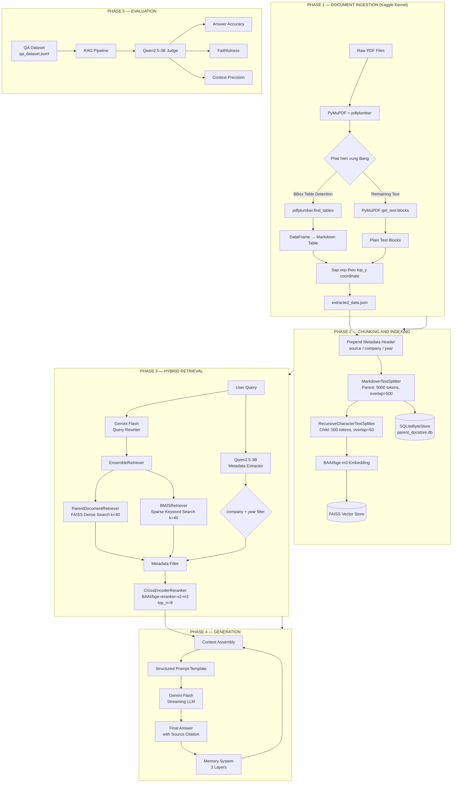
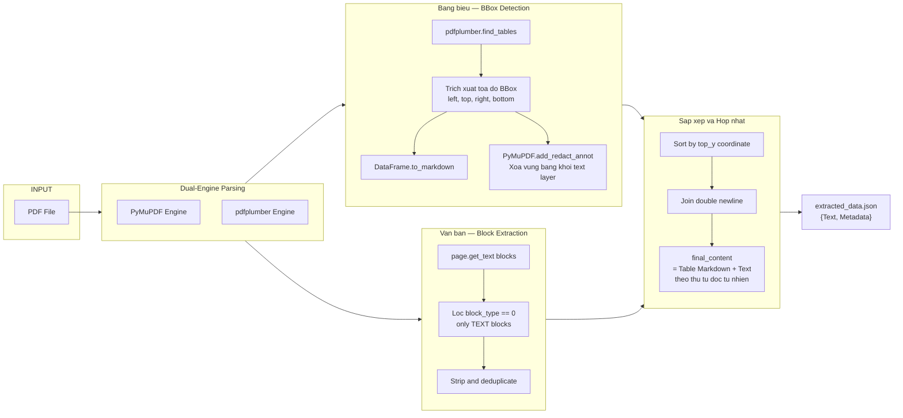
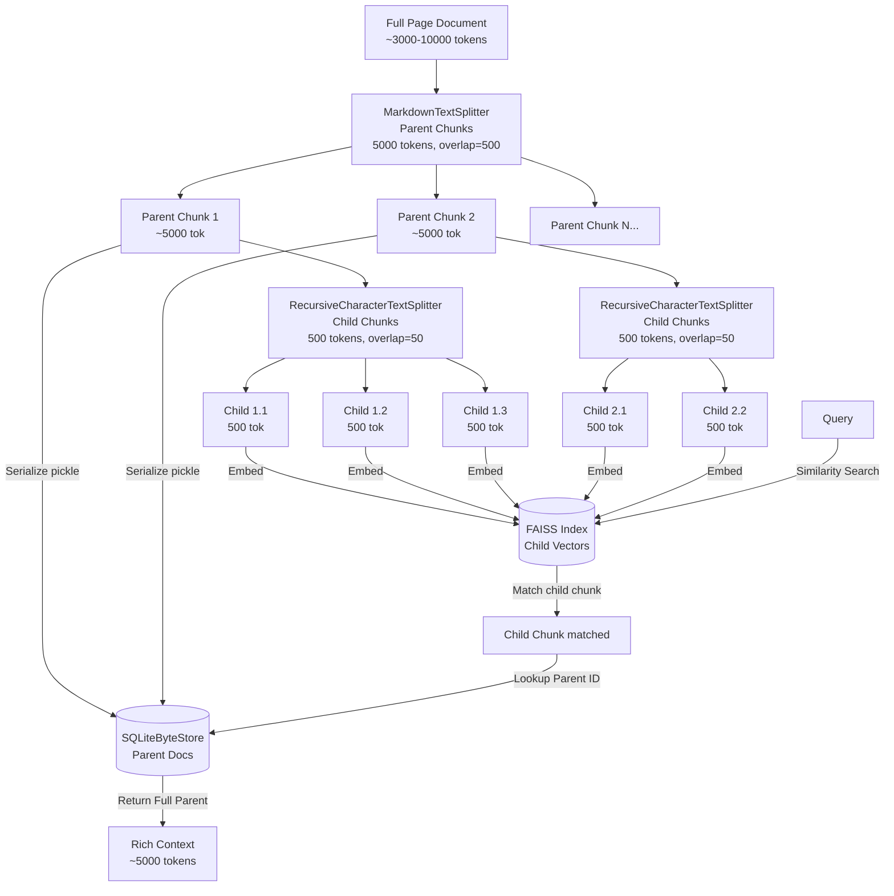
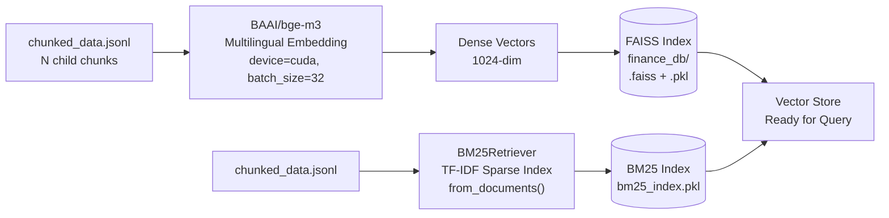
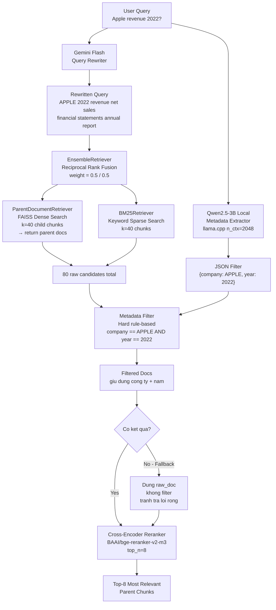
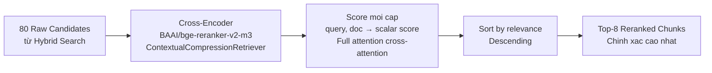
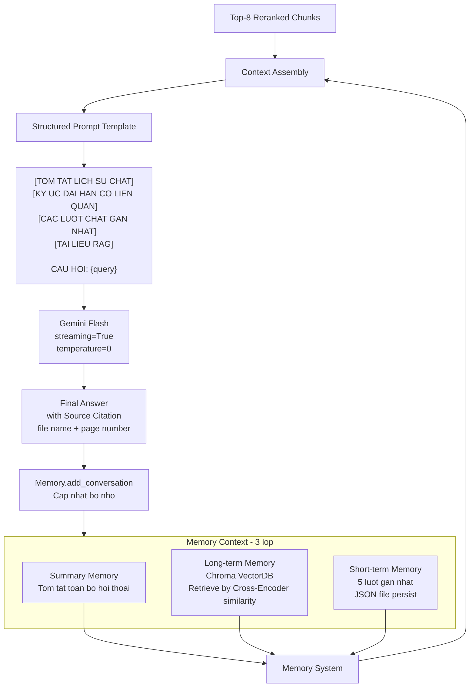
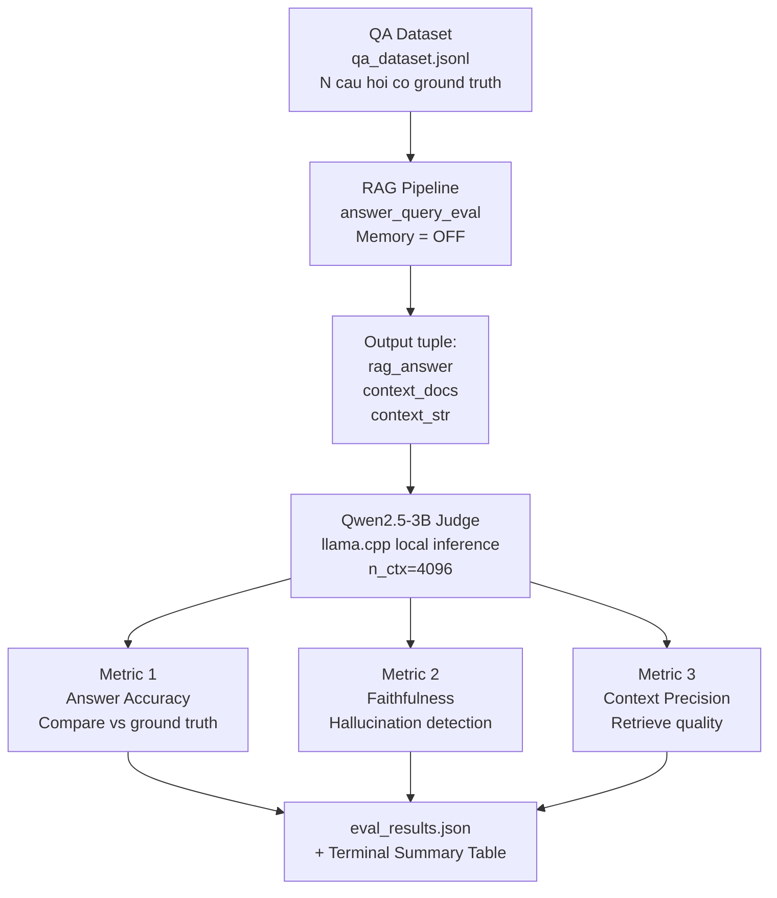

# 📊 FinanceBot — Advanced Financial RAG Chatbot

<div align="center">


**He thong hoi-dap tai lieu tai chinh the he moi, ket hop OCR thong minh, Parent-Child Chunking, Hybrid Search (Dense + BM25), Cross-Encoder Reranking va bo nho hoi thoai 3 lop.**

[Kien truc he thong](#2-kien-truc-tong-quan) • [Cai dat](#7-cai-dat--chay-thu) • [Pipeline chi tiet](#3-pipeline-chi-tiet) • [Danh gia](#5-danh-gia--validation)

</div>

---

## 📋 Mục lục

1. [Giới thiệu](#1-giới-thiệu)
2. [Kiến trúc tổng quan](#2-kiến-trúc-tổng-quan)
3. [Pipeline chi tiết](#3-pipeline-chi-tiết)
   - [3.1 — Giai đoạn Ingestion: Trích xuất PDF](#31--giai-đoạn-ingestion-trích-xuất-pdf)
   - [3.2 — Giai đoạn Chunking: Parent-Child với SQLite](#32--giai-đoạn-chunking-parent-child-với-sqlite)
   - [3.3 — Giai đoạn Embedding & Indexing](#33--giai-đoạn-embedding--indexing)
   - [3.4 — Giai đoạn Retrieval: Hybrid Search](#34--giai-đoạn-retrieval-hybrid-search)
   - [3.5 — Giai đoạn Reranking: Cross-Encoder](#35--giai-đoạn-reranking-cross-encoder)
   - [3.6 — Giai đoạn Generation: LLM + Memory](#36--giai-đoạn-generation-llm--memory)
4. [Hệ thống bộ nhớ 3 lớp](#4-hệ-thống-bộ-nhớ-3-lớp)
5. [Đánh giá & Validation](#5-đánh-giá--validation)
6. [Cấu trúc dự án](#6-cấu-trúc-dự-án)
7. [Cài đặt & Chạy thử](#7-cài-đặt--chạy-thử)
8. [Công nghệ sử dụng](#8-công-nghệ-sử-dụng)

---

## 1. Giới thiệu

**FinanceBot** là một hệ thống **Retrieval-Augmented Generation (RAG)** chuyên biệt cho lĩnh vực tài chính, được thiết kế để trả lời các câu hỏi phức tạp dựa trên báo cáo tài chính doanh nghiệp (10-K, Annual Report...).

### Vấn đề cốt lõi được giải quyết

| Thách thức | Giải pháp trong FinanceBot |
|---|---|
| Tài liệu tài chính chứa bảng phức tạp, số liệu dày đặc | OCR + BBox detection → Markdown table |
| Chunk quá nhỏ mất ngữ cảnh, chunk quá lớn gây nhiễu | Parent-Child Chunking (5000 / 500 tokens) |
| Semantic search bỏ sót từ khóa quan trọng | Hybrid Search: Dense (FAISS) + Sparse (BM25) |
| Top-k raw kết quả chưa đủ chính xác | Cross-Encoder Reranking (`BAAI/bge-reranker-v2-m3`) |
| LLM không nhớ ngữ cảnh hội thoại dài | Memory 3 lớp: Short-term + Long-term + Summary |
| Khó đánh giá chất lượng RAG pipeline | LLM-as-a-judge với 3 metrics độc lập |

---

## 2. Kiến trúc tổng quan



---

## 3. Pipeline chi tiết

### 3.1 — Giai đoạn Ingestion: Trích xuất PDF

> **File:** [`src/ingestion/pdf_loader.py`](src/ingestion/pdf_loader.py)

Đây là bước quan trọng nhất — chất lượng trích xuất quyết định toàn bộ chất lượng hệ thống phía sau.

#### Luồng xử lý chi tiết



#### Kỹ thuật xử lý bảng (BBox Table Detection)

```
Buoc 1: pdfplumber phat hien bang va tra ve BBox = (left, top, right, bottom)

Buoc 2: Convert sang Markdown table format
        | Col 1  | Col 2  | Col 3  |
        |--------|--------|--------|
        | val 1  | val 2  | val 3  |

Buoc 3: Redact vung BBox tren PyMuPDF de tranh doc text trung lap

Buoc 4: PyMuPDF doc phan text con lai (loai bo vung bang da xu ly)

Buoc 5: Sap xep tat ca element theo toa do top (y-axis)
        → dung thu tu doc tu tren xuong duoi
```

> **Tại sao dùng 2 engine song song?**
> - `pdfplumber`: vượt trội phát hiện cấu trúc bảng (bbox, cell merging, border detection)
> - `PyMuPDF`: nhanh hơn và chính xác hơn cho plain text extraction
> - Kết hợp 2 engine → kết quả tốt nhất cả hai mặt

#### Output schema mỗi page

```json
{
  "Text": "source: Apple_2022_10K.pdf, company: APPLE, year: 2022\n\n| Revenue | 2022 | 2021 |\n|---|---|---|\n| Net sales | 394,328 | 365,817 |\n\nApple reported record revenue...",
  "Metadata": {
    "source":      "Apple_2022_10K.pdf",
    "page_number": 47,
    "id":          "doc_a1b2c3d4",
    "total_page":  120
  }
}
```

---

### 3.2 — Giai đoạn Chunking: Parent-Child với SQLite

> **File:** [`src/ingestion/chunker.py`](src/ingestion/chunker.py)

#### Chiến lược Parent-Child Chunking



**Logic hoạt động:**
- **Child chunks** (nhỏ, 500 tok) được embed vào FAISS → dùng để matching chính xác
- **Parent chunks** (lớn, 5000 tok) lưu trong SQLite → trả về cho LLM để có đủ context
- Khi query: match child → lookup parent ID → return parent đầy đủ cho LLM

#### Custom SQLiteByteStore — Thiết kế thay thế LocalFileStore

```
LocalFileStore (van de):               SQLiteByteStore (giai phap):
├── doc_a1b2c3d4.pkl                   parent_docstore.db
├── doc_e5f6g7h8.pkl                   ┌──────────────────────────────────┐
├── doc_i9j0k1l2.pkl                   │ key (TEXT PRIMARY KEY) | value   │
├── ... (hang nghin file nho)          │ doc_a1b2c3d4          | <blob>   │
│                                      │ doc_e5f6g7h8          | <blob>   │
└── Lag khi upload Kaggle Dataset      └──────────────────────────────────┘
    Rat kho quan ly                    → 1 file SQLite duy nhat
                                       → Thread-safe voi threading.Lock()
                                       → De upload/download Kaggle Dataset
```

#### Metadata Enrichment trước khi chunk

Trước khi đưa vào splitter, mỗi document được prepend metadata header:

```
source: Apple_2022_10K.pdf, company: APPLE, year: 2022

document: <noi dung goc cua trang>
```

→ Giúp BM25 bắt được tên công ty/năm ngay trong sparse search
→ Metadata filter phía sau hoạt động chính xác hơn

---

### 3.3 — Giai đoạn Embedding & Indexing

> **File:** [`src/retrieval/vector_db.py`](src/retrieval/vector_db.py)



| Thành phần | Model / Thuật toán | Lý do chọn |
|---|---|---|
| **Dense Embedding** | `BAAI/bge-m3` | Đa ngôn ngữ EN+VI, state-of-the-art cho tài chính |
| **Sparse Index** | BM25 Okapi | Bắt chính xác tên công ty, mã số, thuật ngữ kế toán |
| **Vector Store** | FAISS | Tìm kiếm ANN cực nhanh, hỗ trợ GPU |

**Batching strategy:** Embedding được thực hiện theo batch 5000 docs để tránh OOM trên GPU.

---

### 3.4 — Giai đoạn Retrieval: Hybrid Search

> **File:** [`src/generation/generator.py`](src/generation/generator.py)



#### Chi tiết Query Rewriting Pipeline

```python
# Step 1: Qwen2.5-3B chay local (llama.cpp, khong can API)
# Trich xuat metadata filter tu query
extract_filter("Apple revenue 2022?")
# Output: {"company": "APPLE", "year": "2022"}

# Step 2: Gemini Flash viet lai query thanh finance keywords
rewrite_query("Apple revenue 2022?")
# Output: "Apple 2022. Finance keywords: APPLE, revenue, net sales,
#           total revenue, fiscal year 2022, annual report, 10-K"
```

#### EnsembleRetriever — Hybrid Search Logic

```
Dense (FAISS bi-encoder):
  - Encode query → query vector
  - Tim kiem ANN trong FAISS index
  - Bat duoc: "revenue" ↔ "net sales" ↔ "turnover" (ngu nghia tuong dong)

Sparse (BM25 keyword):
  - TF-IDF scoring tren toan bo corpus
  - Bat chinh xac: "APPLE", "2022", "10-K", "Q4 fiscal" (tu khoa chinh xac)

Ensemble — Reciprocal Rank Fusion (RRF):
  - RRF_score(doc) = Σ 1/(k + rank_i) voi k=60
  - weight=[0.5, 0.5] cho hai retriever
  - Ket hop diem manh cua ca hai phuong phap
```

---

### 3.5 — Giai đoạn Reranking: Cross-Encoder



**Tại sao cần Reranking sau Hybrid Search?**

```
Bi-Encoder (FAISS / BM25):
  ✅ Toc do: O(1) sau khi index
  ❌ Chinh xac: Encode query va doc DOC LAP → khong bat duoc
     moi quan he phuc tap giua cau hoi va van ban

Cross-Encoder:
  ✅ Chinh xac: Encode (query + doc) CUNG LUC → full attention
     bat duoc moi quan he phuc tap, nuance
  ❌ Toc do: O(N) voi N la so candidate → qua cham cho full corpus

Chien luoc toi uu:
  Stage 1 — Recall:    Bi-Encoder lay rong (k=80), nhanh
  Stage 2 — Precision: Cross-Encoder loc chinh xac (top_n=8), cham nhung dung
```

| Stage | Model | k | Muc dich |
|---|---|---|---|
| Dense Search | `BAAI/bge-m3` (Bi-Encoder) | 40 | Recall theo ngu nghia |
| Sparse Search | BM25 | 40 | Recall theo tu khoa |
| Metadata Filter | Rule-based | variable | Loai bo sai cong ty / nam |
| **Reranking** | `BAAI/bge-reranker-v2-m3` | **top 8** | **Precision cao nhat** |

---

### 3.6 — Giai đoạn Generation: LLM + Memory

> **Files:** [`src/generation/generator.py`](src/generation/generator.py) · [`app.py`](app.py)



#### Prompt Engineering — Quy tắc bắt buộc

```
RULES trong system prompt:
1. Uu tien tuyet doi dung [TAI LIEU RAG] — KHONG suy doan neu khong co
2. Dung [Memory] de hieu ngu canh follow-up questions
3. Luon TRICH DAN nguon ro rang (ten file + so trang)
   Vi du: "Theo Apple_2022_10K.pdf, trang 47..."
4. Tinh toan step-by-step khi co yeu cau (ratio, %, YoY...)
5. Kiem tra don vi can than (Millions vs Billions — DUNG nham)
6. Kiem tra chinh xac NAM duoc hoi
   (bao cao tai chinh co du lieu so sanh nhieu nam)
7. Neu khong co trong context → noi thang la khong biet
```

---

## 4. Hệ thống bộ nhớ 3 lớp

> **File:** [`src/generation/memory_manager.py`](src/generation/memory_manager.py)

```mermaid
stateDiagram-v2
    [*] --> NewConversation

    state "Conversation Turn" as Conv {
        UserQuery --> AIResponse
        AIResponse --> AddToShortTerm
    }

    state "Short-term Memory - RAM + JSON" as STM {
        note right of STM
            Luu 5 luot gan nhat
            Persist: short_summary.json
            Reload khi khoi dong lai app
        end note
    }

    state "Long-term Memory - ChromaDB" as LTM {
        note right of LTM
            Luot hoi thoai cu nhat
            Embedded va index
            Retrieve by Cross-Encoder rerank
        end note
    }

    state "Summary Memory - LLM generated" as SUM {
        note right of SUM
            Gemini tom tat tu dong
            Trigger khi short-term day
            Persist: short_summary.json
        end note
    }

    NewConversation --> Conv
    Conv --> STM : add_conversation()
    STM --> LTM : Short-term > 5\npop oldest → embed → store
    STM --> SUM : Trigger update_summary\nGemini rewrites summary
    LTM --> Conv : context() → retrieve top-3\nby Cross-Encoder rerank
    SUM --> Conv : context() → inject as summary
```

| Layer | Storage | Dung luong | Retrieval |
|---|---|---|---|
| **Short-term** | JSON file (in-memory) | 5 lượt gần nhất | Direct lookup O(1) |
| **Long-term** | ChromaDB (disk) | Unlimited | Semantic search + Cross-Encoder rerank |
| **Summary** | JSON file (in-memory) | 1 đoạn tóm tắt | Direct inject into prompt |

**Eval Mode:** Hàm `answer_query_eval()` tắt hoàn toàn Memory để tránh cross-contamination giữa các câu hỏi độc lập trong tập test.

---

## 5. Đánh giá & Validation

> **Files:** [`evaluation/metrics.py`](evaluation/metrics.py) · [`evaluation/metrics_gemini.py`](evaluation/metrics_gemini.py)

### Framework: LLM-as-a-Judge



### Ba metrics đánh giá chi tiết

#### Metric 1: Answer Accuracy

```
Muc tieu: So sanh rag_answer vs truth_answer

Judge prompt format (Qwen Chat Template):
  <|im_start|>system
  Ban la chuyen gia danh gia cau tra loi.
  Dong dau tien PHAI la: DUNG hoac SAI. Sau do giai thich 1 cau.
  <|im_end|>
  <|im_start|>user
  Cau hoi: {question}
  Cau tra loi RAG: {rag_answer[:600]}
  Cau tra loi chuan: {truth_answer[:300]}
  <|im_end|>

Output: {"label": "DUNG|SAI", "score": 1.0|0.0, "reason": "..."}
```

#### Metric 2: Faithfulness (Phát hiện Hallucination)

```
Muc tieu: Do ti le claim trong answer duoc ho tro boi context

Judge dem:
  TOTAL_CLAIMS: <so menh de trong answer>
  SUPPORTED_CLAIMS: <so menh de co trong context>
  REASON: <1 cau giai thich>

Score = SUPPORTED_CLAIMS / TOTAL_CLAIMS ∈ [0.0, 1.0]
Score = 1.0 → khong bịa thêm gi, hoan toan tu context
Score = 0.0 → toan bo bi hallucination
```

#### Metric 3: Context Precision

```
Muc tieu: Trong cac chunk retrieve duoc, bao nhieu % thuc su lien quan

Voi moi chunk, judge tra loi: CO hoac KHONG (relevant?)

Score = relevant_chunks / total_chunks ∈ [0.0, 1.0]
Score cao → retriever chinh xac, it noise
Score thap → retriever lay nhieu chunk khong lien quan
```

### Ví dụ output terminal

```
============================================================
  Bat dau danh gia N cau hoi voi 3 metrics
============================================================

[1/N] What was Apple's net revenue in FY2022?...
  Accuracy=✅  Faithfulness=0.95  CtxPrecision=0.88

[2/N] Calculate 3M's gross margin in 2019...
  Accuracy=❌  Faithfulness=0.72  CtxPrecision=0.75

...

============================================================
  KET QUA DANH GIA (N cau hoi)
============================================================
  Metric                    Score
  ----------------------------------------
  Answer Accuracy           82.5%  (66/80 dung)
  Faithfulness              91.3%  (avg claims supported)
  Context Precision         87.6%  (avg chunk relevant)
============================================================

  Chi tiet da luu → evaluation/eval_results.json
```

---

## 6. Cấu trúc dự án

```
Chatbot_RAG/
│
├── app.py                             # Streamlit UI — Apple Design System
├── .env                               # GOOGLE_API_KEY (khong commit)
├── requirements.txt                   # Dependencies cho Streamlit Cloud (CPU)
├── requirements_local.txt             # Full dependencies (local voi GPU)
│
├── src/
│   ├── __init__.py
│   │
│   ├── ingestion/
│   │   ├── pdf_loader.py              # OCR + BBox table detection (Kaggle)
│   │   └── chunker.py                 # Parent-Child chunking + SQLiteByteStore
│   │
│   ├── retrieval/
│   │   ├── vector_db.py               # FAISS embedding pipeline (Kaggle)
│   │   └── search.py                  # Simple search utility (legacy)
│   │
│   └── generation/
│       ├── generator.py               # Hybrid Search + Rerank + LLM generation
│       ├── memory_manager.py          # 3-layer memory system
│       └── load_model.py              # Qwen2.5-3B loader + metadata extractor
│
├── evaluation/
│   ├── metrics.py                     # LLM-as-judge (Qwen local inference)
│   ├── metrics_gemini.py              # LLM-as-judge (Gemini API version)
│   ├── qa_dataset.jsonl               # Test questions voi ground truth
│   └── financebench_open_source.jsonl # FinanceBench benchmark dataset
│
├── data/
│   ├── raw_data/                      # PDF goc (10-K, Annual Reports)
│   ├── processed/
│   │   ├── extracted_data.json        # Output cua pdf_loader.py
│   │   └── chunked_data.jsonl         # Child chunks sau khi split
│   └── vector_store/
│       ├── finance_db/                # FAISS index (.faiss + .pkl)
│       │   └── bm25_index.pkl         # BM25 serialized index
│       ├── parent_db/
│       │   └── parent_docstore.db     # SQLite parent documents
│       └── memory_db/
│           ├── chroma.sqlite3         # ChromaDB long-term memory
│           └── short_summary.json     # Short-term + summary persist
│
├── models/
│   └── qwen2.5_3B/
│       └── qwen2.5-coder-3b-instruct-q5_k_m.gguf  # Local LLM (llama.cpp Q5)
│
└── experiments/
    └── chunking_test.ipynb            # Notebooks thi nghiem chunking
```

---

## 7. Cài đặt & Chạy thử

### Yêu cầu hệ thống

| Thành phần | Tối thiểu | Khuyến nghị |
|---|---|---|
| Python | 3.10+ | 3.11 |
| RAM | 16 GB | 32 GB |
| GPU VRAM | 8 GB | 16 GB |
| Disk | 20 GB | 50 GB |
| CUDA | 11.8+ | 12.x |

### Bước 1: Clone & Cài đặt

```bash
git clone https://github.com/your-username/Chatbot_RAG.git
cd Chatbot_RAG

# Tao virtual environment
python -m venv venv
source venv/bin/activate        # Linux / Mac
.\venv\Scripts\activate         # Windows PowerShell

# Cai dat full dependencies (local voi GPU)
pip install -r requirements_local.txt

# Hoac cho Streamlit Cloud (CPU only, khong llama.cpp)
pip install -r requirements.txt
```

### Bước 2: Cấu hình API Key

```bash
# Tao file .env tai thu muc goc
echo "GOOGLE_API_KEY=your_gemini_api_key_here" > .env
```

### Bước 3: Build dữ liệu (End-to-End)

```bash
# [KAGGLE] Buoc 1: Trich xuat PDF → JSON
# Upload pdf_loader.py len Kaggle Notebook (GPU T4/P100)
# Output: extracted_data.json

# [KAGGLE] Buoc 2: Chunking + Build FAISS + SQLite
# Upload chunker.py len Kaggle Notebook (GPU)
# Input:  extracted_data.json
# Output: finance_db/ + parent_docstore.db + chunked_data.jsonl

# [LOCAL] Buoc 3: Download ve may
# Copy vao dung duong dan:
# - finance_db/         → data/vector_store/finance_db/
# - parent_docstore.db  → data/vector_store/parent_db/
# - chunked_data.jsonl  → data/processed/
```

### Bước 4: Chạy ứng dụng

```bash
# Chay Streamlit Web UI
streamlit run app.py
# Truy cap: http://localhost:8501

# Hoac test CLI truc tiep
python src/generation/generator.py "What was Apple's total revenue in FY2022?"
```

### Bước 5: Chạy đánh giá

```bash
# Danh gia pipeline voi 3 metrics
python evaluation/metrics.py

# Ket qua:
# - Terminal: bang tom tat
# - evaluation/eval_results.json: chi tiet tung cau hoi
```

---

## 8. Công nghệ sử dụng

### AI / ML Models

| Model | Vai trò | Deployment | Quantization |
|---|---|---|---|
| `BAAI/bge-m3` | Multilingual Dense Embedding | HuggingFace local (GPU) | FP16 |
| `BAAI/bge-reranker-v2-m3` | Cross-Encoder Reranking | HuggingFace local (GPU) | FP16 |
| `Qwen2.5-Coder-3B-Instruct` | Metadata extraction + LLM Judge | llama.cpp local | Q5_K_M GGUF |
| `Gemini Flash` | Query rewriting + Final answer | Google Gemini API | Cloud |

### Framework & Libraries

| Library | Version | Muc dich |
|---|---|---|
| `langchain` + `langchain-core` | ≥0.3 | RAG orchestration framework |
| `langchain-classic` | latest | ParentDocumentRetriever, EnsembleRetriever, CrossEncoderReranker |
| `langchain-community` | latest | FAISS, BM25Retriever, HuggingFaceCrossEncoder |
| `langchain-huggingface` | ≥0.1 | HuggingFaceEmbeddings wrapper |
| `langchain-google-genai` | ≥1.0 | Gemini Flash integration |
| `faiss-gpu` / `faiss-cpu` | latest | Vector similarity search |
| `chromadb` | ≥0.5 | Long-term memory vector store |
| `pymupdf` | ≥1.24 | PDF text extraction + redaction |
| `pdfplumber` | latest | Table structure detection |
| `rank-bm25` | latest | BM25 sparse retrieval |
| `llama-cpp-python` | latest | Local LLM inference (Qwen2.5) |
| `sentence-transformers` | ≥3.0 | Embedding utilities |
| `streamlit` | ≥1.35 | Web UI framework |
| `sqlite3` | builtin | Parent document store |
| `python-dotenv` | ≥1.0 | Environment config |

### Infrastructure & Deployment

```
Indexing Pipeline:    Kaggle Notebooks (GPU T4 / P100 / A100)
                      → Xu ly PDF lon, embedding BAAI/bge-m3 CUDA

Local Development:    Windows / Linux voi GPU NVIDIA
                      → llama.cpp inference, full pipeline test

Production Deploy:    Streamlit Community Cloud (CPU)
                      → Streamlit app.py, requirements.txt nhe hon
                      → Khong co llama.cpp (dung Gemini API thay the)

LLM API:              Google Gemini Flash (free tier co san)
Local Model:          Qwen2.5-3B Q5_K_M GGUF (400MB, chay tren CPU/GPU)
```

---

## 📌 Ghi chú kỹ thuật quan trọng

### Thread-Safety
`SQLiteByteStore` được thiết kế thread-safe với `threading.Lock()`, phù hợp cho deployment multi-user trên Streamlit Cloud.

### Eval vs Chat Mode
Hàm `answer_query_eval()` tắt hoàn toàn Memory để tránh cross-contamination giữa các câu hỏi độc lập trong tập test. Chỉ `answer_query()` (chat mode) mới sử dụng Memory.

### Model Caching
Tất cả models (embedding, reranker, LLM) được cache với `@functools.lru_cache(maxsize=1)` — chỉ load một lần duy nhất, tránh reload mỗi request (tốn thời gian + RAM).

### Metadata Filtering Fallback
Nếu filter theo company + year không tìm được document nào, hệ thống tự động fallback về dùng raw_doc không filter → tránh trả lời rỗng hoàn toàn.

---

<div align="center">

**FinanceBot** — Built with LangChain, FAISS, Gemini Flash and Qwen2.5

*Du lieu chi tu tai lieu da nap vao he thong — Khong suy doan, khong bia dat*

Copyright © 2025 FinanceBot

</div>
